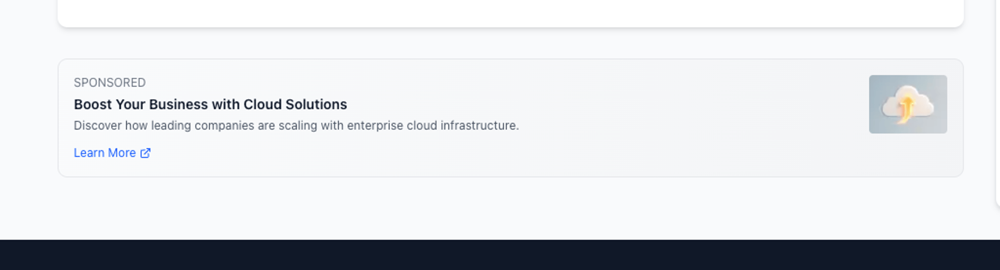
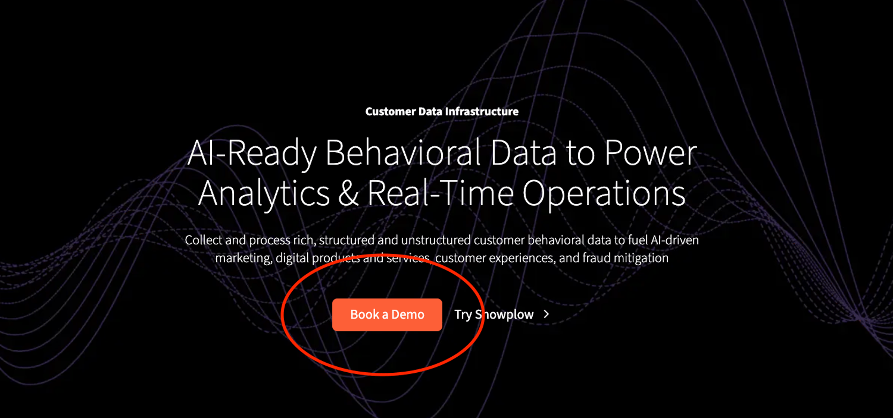

# Implementation instructions

_A guide on how to implement tracking for the generated Event Specifications._

**Table of contents:**
- [Ad Impression](#ad-impression)
- [Quick Search](#quick-search)
- [Full Search](#full-search)
- [Article View](#article-view)
- [Newsletter Signup](#newsletter-signup)
- [Ad Click](#ad-click)
- [Create Account](#create-account)

## [Ad Impression](https://console.snowplowanalytics.com/b12539df-a711-42bd-bdfa-175308c55fd5/data-products/58526f0a-c5b6-4d08-bc4f-199836217d0c/event-specifications/6511cf68-d715-4729-b83e-4c7ede68ccbb)

|       |  |
| ----------- | ----------- |  
| **Id** | 6511cf68-d715-4729-b83e-4c7ede68ccbb |
| **Version** | 11 |
| **Data Product Id** | 58526f0a-c5b6-4d08-bc4f-199836217d0c | 
| **Source Application/s** | The Daily Query - Media & Publishing |
| **Event Data Structure** | ad_interaction/1-0-0 |
| **Entity Data Structures** | ad/1-0-0 |
| **Code** | [Link](./snowplow.ts#L639) |
| **Data Product Domain** | Marketing |

### Implementation Instructions for ad_interaction event properties

#### Property Rules
|    Name   | Required  | Description |  Exact value(s) expected |
| ----------- | ----------- |  ----------- |  ----------- |  
type | ✅ | The type of ad interaction | `impression`

#### Entity Cardinality Rules
|    Name   | Required  | Number of entities  |
| ----------- | ----------- |  ----------- |
ad | ✅ | Exactly `1`

### Trigger 

#### Screenshot

#### In which application(s) does this trigger apply?

_N/A_

#### The URL of the page on which this event specification triggers:

_N/A_

#### Notes

When an ad or sponsorship is visible to the user

## [Quick Search](https://console.snowplowanalytics.com/b12539df-a711-42bd-bdfa-175308c55fd5/data-products/98f633e6-ab32-43a8-8e07-0d6124da0ee7/event-specifications/73383b45-f16a-4249-b7d1-3edf0731713b)

|       |  |
| ----------- | ----------- |  
| **Id** | 73383b45-f16a-4249-b7d1-3edf0731713b |
| **Version** | 5 |
| **Data Product Id** | 98f633e6-ab32-43a8-8e07-0d6124da0ee7 | 
| **Source Application/s** | The Daily Query - Media & Publishing |
| **Event Data Structure** | search_performed/1-0-0 |
| **Entity Data Structures** | article/1-0-0 |
| **Code** | [Link](./snowplow.ts#L663) |
| **Data Product Domain** | Product |

### Implementation Instructions for search_performed event properties

#### Property Rules
|    Name   | Required  | Description |  Exact value(s) expected |
| ----------- | ----------- |  ----------- |  ----------- |  
term | ✅ | The search term entered by the user. | -
search_type | ❌ | - | `quick`

#### Entity Cardinality Rules
|    Name   | Required  | Number of entities  |
| ----------- | ----------- |  ----------- |
article | ✅ | Exactly `1`

### Trigger 

#### Screenshot

#### In which application(s) does this trigger apply?

_N/A_

#### The URL of the page on which this event specification triggers:

_N/A_

#### Notes

Fire this event when the user selects an article from the suggestions dropdown in the search box

## [Full Search](https://console.snowplowanalytics.com/b12539df-a711-42bd-bdfa-175308c55fd5/data-products/98f633e6-ab32-43a8-8e07-0d6124da0ee7/event-specifications/c2a5edb5-594f-444f-9d22-eed1081b41bf)

|       |  |
| ----------- | ----------- |  
| **Id** | c2a5edb5-594f-444f-9d22-eed1081b41bf |
| **Version** | 5 |
| **Data Product Id** | 98f633e6-ab32-43a8-8e07-0d6124da0ee7 | 
| **Source Application/s** | The Daily Query - Media & Publishing |
| **Event Data Structure** | search_performed/1-0-0 |
| **Entity Data Structures** | article/1-0-0 |
| **Code** | [Link](./snowplow.ts#L687) |
| **Data Product Domain** | Product |

### Implementation Instructions for search_performed event properties

#### Property Rules
|    Name   | Required  | Description |  Exact value(s) expected |
| ----------- | ----------- |  ----------- |  ----------- |  
term | ✅ | The search term entered by the user. | -
search_type | ❌ | - | `full`

#### Entity Cardinality Rules
|    Name   | Required  | Number of entities  |
| ----------- | ----------- |  ----------- |
article | ❌ | Between `0` and `99`

### Trigger 

#### Screenshot

#### In which application(s) does this trigger apply?

_N/A_

#### The URL of the page on which this event specification triggers:

_N/A_

#### Notes

Fire this event when the user is taken to the results page for their search

## [Article View](https://console.snowplowanalytics.com/b12539df-a711-42bd-bdfa-175308c55fd5/data-products/98f633e6-ab32-43a8-8e07-0d6124da0ee7/event-specifications/207d6f27-a125-402a-b515-d40064d0f1c4)

|       |  |
| ----------- | ----------- |  
| **Id** | 207d6f27-a125-402a-b515-d40064d0f1c4 |
| **Version** | 10 |
| **Data Product Id** | 98f633e6-ab32-43a8-8e07-0d6124da0ee7 | 
| **Source Application/s** | The Daily Query - Media & Publishing |
| **Event Data Structure** | article_interaction/1-0-0 |
| **Entity Data Structures** | article/1-0-0 |
| **Code** | [Link](./snowplow.ts#L543) |
| **Data Product Domain** | Product |

### Implementation Instructions for article_interaction event properties

#### Property Rules
|    Name   | Required  | Description |  Exact value(s) expected |
| ----------- | ----------- |  ----------- |  ----------- |  
type | ✅ | The type of article interaction | `view`

#### Entity Cardinality Rules
|    Name   | Required  | Number of entities  |
| ----------- | ----------- |  ----------- |
article | ✅ | Exactly `1`

### Trigger 

#### Screenshot

#### In which application(s) does this trigger apply?

`media-publishing-web` 

#### The URL of the page on which this event specification triggers:

_N/A_

#### Notes

When a user loads the full page of an article

## [Newsletter Signup](https://console.snowplowanalytics.com/b12539df-a711-42bd-bdfa-175308c55fd5/data-products/ead1f30f-1234-4350-a112-02003991e391/event-specifications/48dac2dc-e478-49a0-875f-ce27281c84f4)

|       |  |
| ----------- | ----------- |  
| **Id** | 48dac2dc-e478-49a0-875f-ce27281c84f4 |
| **Version** | 8 |
| **Data Product Id** | ead1f30f-1234-4350-a112-02003991e391 | 
| **Source Application/s** | The Daily Query - Media & Publishing |
| **Event Data Structure** | conversion_event/1-0-0 |
| **Entity Data Structures** | ab_test/1-0-0 |
| **Code** | [Link](./snowplow.ts#L591) |
| **Data Product Domain** | Marketing |

### Implementation Instructions for conversion_event event properties

#### Property Rules
|    Name   | Required  | Description |  Exact value(s) expected |
| ----------- | ----------- |  ----------- |  ----------- |  
conversion_type | ✅ | The type of conversion the user completed. | `newsletter_signup`

#### Entity Cardinality Rules
|    Name   | Required  | Number of entities  |
| ----------- | ----------- |  ----------- |
ab_test | ❌ | At least `0`

### Trigger 

#### Screenshot

#### In which application(s) does this trigger apply?

`media-publishing-web` 

#### The URL of the page on which this event specification triggers:

_N/A_

#### Notes

Trigger when the user clicks the "Subscribe" button

## [Ad Click](https://console.snowplowanalytics.com/b12539df-a711-42bd-bdfa-175308c55fd5/data-products/58526f0a-c5b6-4d08-bc4f-199836217d0c/event-specifications/5f04be54-cc64-4e50-90f6-a85df727a50e)

|       |  |
| ----------- | ----------- |  
| **Id** | 5f04be54-cc64-4e50-90f6-a85df727a50e |
| **Version** | 7 |
| **Data Product Id** | 58526f0a-c5b6-4d08-bc4f-199836217d0c | 
| **Source Application/s** | The Daily Query - Media & Publishing |
| **Event Data Structure** | ad_interaction/1-0-0 |
| **Entity Data Structures** | ad/1-0-0 |
| **Code** | [Link](./snowplow.ts#L615) |
| **Data Product Domain** | Marketing |

### Implementation Instructions for ad_interaction event properties

#### Property Rules
|    Name   | Required  | Description |  Exact value(s) expected |
| ----------- | ----------- |  ----------- |  ----------- |  
type | ✅ | The type of ad interaction | `click`

#### Entity Cardinality Rules
|    Name   | Required  | Number of entities  |
| ----------- | ----------- |  ----------- |
ad | ✅ | Exactly `1`

### Trigger 

#### Screenshot

#### In which application(s) does this trigger apply?

`media-publishing-web` 

#### The URL of the page on which this event specification triggers:

_N/A_

#### Notes

When an advertising element is click on by the user

## [Create Account](https://console.snowplowanalytics.com/b12539df-a711-42bd-bdfa-175308c55fd5/data-products/ead1f30f-1234-4350-a112-02003991e391/event-specifications/40ffc5df-9007-460b-8be1-79db97731299)

|       |  |
| ----------- | ----------- |  
| **Id** | 40ffc5df-9007-460b-8be1-79db97731299 |
| **Version** | 5 |
| **Data Product Id** | ead1f30f-1234-4350-a112-02003991e391 | 
| **Source Application/s** | The Daily Query - Media & Publishing |
| **Event Data Structure** | conversion_event/1-0-0 |
| **Entity Data Structures** |  |
| **Code** | [Link](./snowplow.ts#L567) |
| **Data Product Domain** | Marketing |

### Implementation Instructions for conversion_event event properties

#### Property Rules
|    Name   | Required  | Description |  Exact value(s) expected |
| ----------- | ----------- |  ----------- |  ----------- |  
conversion_type | ✅ | The type of conversion the user completed. | `signup`

### Trigger 1

#### Screenshot

#### In which application(s) does this trigger apply?

`duncan_app` ,`duncan_app_mobile` 

#### The URL of the page on which this event specification triggers:

_N/A_

#### Notes

Trigger when the user clicks the "Book a Demo" button

### Trigger 2

#### Screenshot

#### In which application(s) does this trigger apply?

`media-publishing-web` 

#### The URL of the page on which this event specification triggers:

_N/A_

#### Notes

When a user clicks the "Sign Up" button

