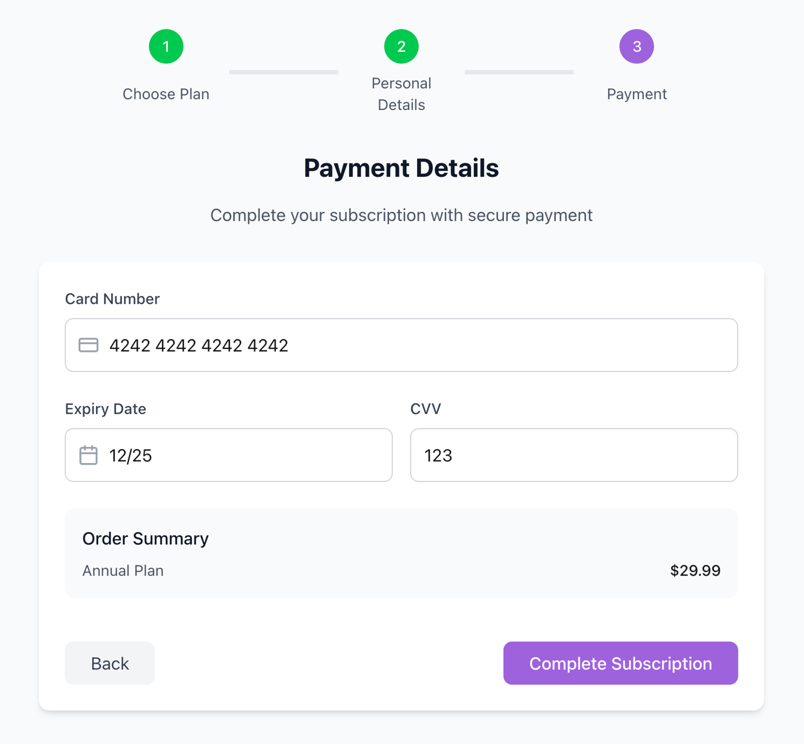
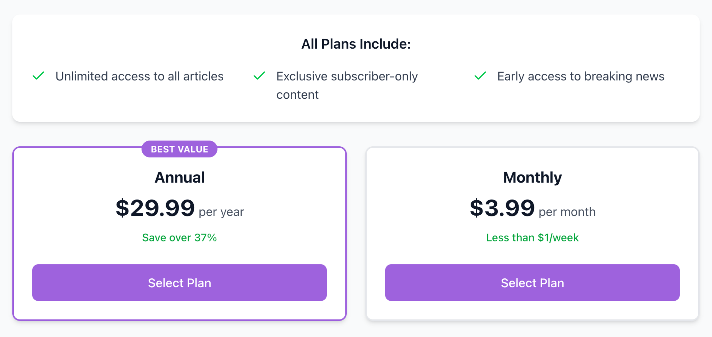

# Implementation instructions

_A guide on how to implement tracking for the generated Event Specifications._

**Table of contents:**
- [Login Success](#login-success)
- [Enter Subscription Flow](#enter-subscription-flow)
- [Confirm Payment](#confirm-payment)
- [Select a Plan](#select-a-plan)
- [Personal Details](#personal-details)
- [Newsletter Signup](#newsletter-signup)
- [Quick Search](#quick-search)
- [Ad Impression](#ad-impression)
- [Ad Click](#ad-click)
- [Full Search](#full-search)
- [Article View](#article-view)

## [Login Success](https://console.snowplowanalytics.com/b12539df-a711-42bd-bdfa-175308c55fd5/data-products/ead1f30f-1234-4350-a112-02003991e391/event-specifications/fbda2b20-8c46-4750-833b-bf9cbcaf165e)

|       |  |
| ----------- | ----------- |  
| **Id** | fbda2b20-8c46-4750-833b-bf9cbcaf165e |
| **Version** | 2 |
| **Data Product Id** | ead1f30f-1234-4350-a112-02003991e391 | 
| **Source Application/s** | The Daily Query - Media & Publishing |
| **Event Data Structure** | login/1-0-0 |
| **Entity Data Structures** |  |
| **Code** | [Link](./snowplow.ts#L946) |
| **Data Product Domain** | Marketing |

### Implementation Instructions for login event properties

#### Property Rules
|    Name   | Required  | Description |  Exact value(s) expected |
| ----------- | ----------- |  ----------- |  ----------- |  
login_status | ❌ | - | `success`

## [Enter Subscription Flow](https://console.snowplowanalytics.com/b12539df-a711-42bd-bdfa-175308c55fd5/data-products/ead1f30f-1234-4350-a112-02003991e391/event-specifications/eca878e2-aa58-48d5-b3dd-86980ec2fc03)

|       |  |
| ----------- | ----------- |  
| **Id** | eca878e2-aa58-48d5-b3dd-86980ec2fc03 |
| **Version** | 3 |
| **Data Product Id** | ead1f30f-1234-4350-a112-02003991e391 | 
| **Source Application/s** | The Daily Query - Media & Publishing |
| **Event Data Structure** | subscription_workflow/1-0-0 |
| **Entity Data Structures** |  |
| **Code** | [Link](./snowplow.ts#L922) |
| **Data Product Domain** | Marketing |

### Implementation Instructions for subscription_workflow event properties

#### Property Rules
|    Name   | Required  | Description |  Exact value(s) expected |
| ----------- | ----------- |  ----------- |  ----------- |  
step_name | ✅ | The name of the step the user is currently on in the subscription workflow. | `begin_workflow`

### Trigger 

#### Screenshot

#### In which application(s) does this trigger apply?

_N/A_

#### The URL of the page on which this event specification triggers:

http://www.thedailyquery.com/subscribe

#### Notes

When a user lands on the subscription page

## [Confirm Payment](https://console.snowplowanalytics.com/b12539df-a711-42bd-bdfa-175308c55fd5/data-products/ead1f30f-1234-4350-a112-02003991e391/event-specifications/05f604ca-af39-4f32-8b81-d35ec7c17720)

|       |  |
| ----------- | ----------- |  
| **Id** | 05f604ca-af39-4f32-8b81-d35ec7c17720 |
| **Version** | 6 |
| **Data Product Id** | ead1f30f-1234-4350-a112-02003991e391 | 
| **Source Application/s** | The Daily Query - Media & Publishing |
| **Event Data Structure** | subscription_workflow/1-0-0 |
| **Entity Data Structures** |  |
| **Code** | [Link](./snowplow.ts#L706) |
| **Data Product Domain** | Marketing |

### Implementation Instructions for subscription_workflow event properties

#### Property Rules
|    Name   | Required  | Description |  Exact value(s) expected |
| ----------- | ----------- |  ----------- |  ----------- |  
step_name | ✅ | The name of the step the user is currently on in the subscription workflow. | `confirm_payment`

### Trigger 

#### Screenshot

#### In which application(s) does this trigger apply?

_N/A_

#### The URL of the page on which this event specification triggers:

http://www.thedailyquery.com/subscribe

#### Notes

When the user hits 'Complete Subscription' after entering their payment details

## [Select a Plan](https://console.snowplowanalytics.com/b12539df-a711-42bd-bdfa-175308c55fd5/data-products/ead1f30f-1234-4350-a112-02003991e391/event-specifications/d30cf2d2-23ed-4faa-889b-bb776182d8ab)

|       |  |
| ----------- | ----------- |  
| **Id** | d30cf2d2-23ed-4faa-889b-bb776182d8ab |
| **Version** | 5 |
| **Data Product Id** | ead1f30f-1234-4350-a112-02003991e391 | 
| **Source Application/s** | The Daily Query - Media & Publishing |
| **Event Data Structure** | subscription_workflow/1-0-0 |
| **Entity Data Structures** |  |
| **Code** | [Link](./snowplow.ts#L898) |
| **Data Product Domain** | Marketing |

### Implementation Instructions for subscription_workflow event properties

#### Property Rules
|    Name   | Required  | Description |  Exact value(s) expected |
| ----------- | ----------- |  ----------- |  ----------- |  
value | ❌ | Whether the user selects a monthly or annual plan | `monthly` or `annualy`
step_name | ✅ | The name of the step the user is currently on in the subscription workflow. | `select_plan`

### Trigger 

#### Screenshot

#### In which application(s) does this trigger apply?

_N/A_

#### The URL of the page on which this event specification triggers:

http://www.thedailyquery.com/subscribe

#### Notes

When a user picks a plan

## [Personal Details](https://console.snowplowanalytics.com/b12539df-a711-42bd-bdfa-175308c55fd5/data-products/ead1f30f-1234-4350-a112-02003991e391/event-specifications/3962b139-d376-4ff3-9554-e78df3332676)

|       |  |
| ----------- | ----------- |  
| **Id** | 3962b139-d376-4ff3-9554-e78df3332676 |
| **Version** | 3 |
| **Data Product Id** | ead1f30f-1234-4350-a112-02003991e391 | 
| **Source Application/s** | The Daily Query - Media & Publishing |
| **Event Data Structure** | subscription_workflow/1-0-0 |
| **Entity Data Structures** |  |
| **Code** | [Link](./snowplow.ts#L754) |
| **Data Product Domain** | Marketing |

### Implementation Instructions for subscription_workflow event properties

#### Property Rules
|    Name   | Required  | Description |  Exact value(s) expected |
| ----------- | ----------- |  ----------- |  ----------- |  
step_name | ✅ | The name of the step the user is currently on in the subscription workflow. | `personal_details`

### Trigger 

#### Screenshot

#### In which application(s) does this trigger apply?

_N/A_

#### The URL of the page on which this event specification triggers:

http://www.thedailyquery.com/subscribe

#### Notes

When the user hits 'continue' after entering their personal details

## [Newsletter Signup](https://console.snowplowanalytics.com/b12539df-a711-42bd-bdfa-175308c55fd5/data-products/ead1f30f-1234-4350-a112-02003991e391/event-specifications/48dac2dc-e478-49a0-875f-ce27281c84f4)

|       |  |
| ----------- | ----------- |  
| **Id** | 48dac2dc-e478-49a0-875f-ce27281c84f4 |
| **Version** | 8 |
| **Data Product Id** | ead1f30f-1234-4350-a112-02003991e391 | 
| **Source Application/s** | The Daily Query - Media & Publishing |
| **Event Data Structure** | conversion_event/1-0-0 |
| **Entity Data Structures** | ab_test/1-0-0 |
| **Code** | [Link](./snowplow.ts#L778) |
| **Data Product Domain** | Marketing |

### Implementation Instructions for conversion_event event properties

#### Property Rules
|    Name   | Required  | Description |  Exact value(s) expected |
| ----------- | ----------- |  ----------- |  ----------- |  
conversion_type | ✅ | The type of conversion the user completed. | `newsletter_signup`

#### Entity Cardinality Rules
|    Name   | Required  | Number of entities  |
| ----------- | ----------- |  ----------- |
ab_test | ❌ | At least `0`

### Trigger 

#### Screenshot

#### In which application(s) does this trigger apply?

`media-publishing-web` 

#### The URL of the page on which this event specification triggers:

_N/A_

#### Notes

Trigger when the user clicks the "Subscribe" button

## [Quick Search](https://console.snowplowanalytics.com/b12539df-a711-42bd-bdfa-175308c55fd5/data-products/98f633e6-ab32-43a8-8e07-0d6124da0ee7/event-specifications/73383b45-f16a-4249-b7d1-3edf0731713b)

|       |  |
| ----------- | ----------- |  
| **Id** | 73383b45-f16a-4249-b7d1-3edf0731713b |
| **Version** | 5 |
| **Data Product Id** | 98f633e6-ab32-43a8-8e07-0d6124da0ee7 | 
| **Source Application/s** | The Daily Query - Media & Publishing |
| **Event Data Structure** | search_performed/1-0-0 |
| **Entity Data Structures** | article/1-0-0 |
| **Code** | [Link](./snowplow.ts#L850) |
| **Data Product Domain** | Product |

### Implementation Instructions for search_performed event properties

#### Property Rules
|    Name   | Required  | Description |  Exact value(s) expected |
| ----------- | ----------- |  ----------- |  ----------- |  
term | ✅ | The search term entered by the user. | -
search_type | ❌ | - | `quick`

#### Entity Cardinality Rules
|    Name   | Required  | Number of entities  |
| ----------- | ----------- |  ----------- |
article | ✅ | Exactly `1`

### Trigger 

#### Screenshot

#### In which application(s) does this trigger apply?

_N/A_

#### The URL of the page on which this event specification triggers:

_N/A_

#### Notes

Fire this event when the user selects an article from the suggestions dropdown in the search box

## [Ad Impression](https://console.snowplowanalytics.com/b12539df-a711-42bd-bdfa-175308c55fd5/data-products/58526f0a-c5b6-4d08-bc4f-199836217d0c/event-specifications/6511cf68-d715-4729-b83e-4c7ede68ccbb)

|       |  |
| ----------- | ----------- |  
| **Id** | 6511cf68-d715-4729-b83e-4c7ede68ccbb |
| **Version** | 11 |
| **Data Product Id** | 58526f0a-c5b6-4d08-bc4f-199836217d0c | 
| **Source Application/s** | The Daily Query - Media & Publishing |
| **Event Data Structure** | ad_interaction/1-0-0 |
| **Entity Data Structures** | ad/1-0-0 |
| **Code** | [Link](./snowplow.ts#L826) |
| **Data Product Domain** | Marketing |

### Implementation Instructions for ad_interaction event properties

#### Property Rules
|    Name   | Required  | Description |  Exact value(s) expected |
| ----------- | ----------- |  ----------- |  ----------- |  
type | ✅ | The type of ad interaction | `impression`

#### Entity Cardinality Rules
|    Name   | Required  | Number of entities  |
| ----------- | ----------- |  ----------- |
ad | ✅ | Exactly `1`

### Trigger 

#### Screenshot

#### In which application(s) does this trigger apply?

_N/A_

#### The URL of the page on which this event specification triggers:

_N/A_

#### Notes

When an ad or sponsorship is visible to the user

## [Ad Click](https://console.snowplowanalytics.com/b12539df-a711-42bd-bdfa-175308c55fd5/data-products/58526f0a-c5b6-4d08-bc4f-199836217d0c/event-specifications/5f04be54-cc64-4e50-90f6-a85df727a50e)

|       |  |
| ----------- | ----------- |  
| **Id** | 5f04be54-cc64-4e50-90f6-a85df727a50e |
| **Version** | 7 |
| **Data Product Id** | 58526f0a-c5b6-4d08-bc4f-199836217d0c | 
| **Source Application/s** | The Daily Query - Media & Publishing |
| **Event Data Structure** | ad_interaction/1-0-0 |
| **Entity Data Structures** | ad/1-0-0 |
| **Code** | [Link](./snowplow.ts#L802) |
| **Data Product Domain** | Marketing |

### Implementation Instructions for ad_interaction event properties

#### Property Rules
|    Name   | Required  | Description |  Exact value(s) expected |
| ----------- | ----------- |  ----------- |  ----------- |  
type | ✅ | The type of ad interaction | `click`

#### Entity Cardinality Rules
|    Name   | Required  | Number of entities  |
| ----------- | ----------- |  ----------- |
ad | ✅ | Exactly `1`

### Trigger 

#### Screenshot

#### In which application(s) does this trigger apply?

`media-publishing-web` 

#### The URL of the page on which this event specification triggers:

_N/A_

#### Notes

When an advertising element is click on by the user

## [Full Search](https://console.snowplowanalytics.com/b12539df-a711-42bd-bdfa-175308c55fd5/data-products/98f633e6-ab32-43a8-8e07-0d6124da0ee7/event-specifications/c2a5edb5-594f-444f-9d22-eed1081b41bf)

|       |  |
| ----------- | ----------- |  
| **Id** | c2a5edb5-594f-444f-9d22-eed1081b41bf |
| **Version** | 5 |
| **Data Product Id** | 98f633e6-ab32-43a8-8e07-0d6124da0ee7 | 
| **Source Application/s** | The Daily Query - Media & Publishing |
| **Event Data Structure** | search_performed/1-0-0 |
| **Entity Data Structures** | article/1-0-0 |
| **Code** | [Link](./snowplow.ts#L874) |
| **Data Product Domain** | Product |

### Implementation Instructions for search_performed event properties

#### Property Rules
|    Name   | Required  | Description |  Exact value(s) expected |
| ----------- | ----------- |  ----------- |  ----------- |  
term | ✅ | The search term entered by the user. | -
search_type | ❌ | - | `full`

#### Entity Cardinality Rules
|    Name   | Required  | Number of entities  |
| ----------- | ----------- |  ----------- |
article | ❌ | Between `0` and `99`

### Trigger 

#### Screenshot

#### In which application(s) does this trigger apply?

_N/A_

#### The URL of the page on which this event specification triggers:

_N/A_

#### Notes

Fire this event when the user is taken to the results page for their search

## [Article View](https://console.snowplowanalytics.com/b12539df-a711-42bd-bdfa-175308c55fd5/data-products/98f633e6-ab32-43a8-8e07-0d6124da0ee7/event-specifications/207d6f27-a125-402a-b515-d40064d0f1c4)

|       |  |
| ----------- | ----------- |  
| **Id** | 207d6f27-a125-402a-b515-d40064d0f1c4 |
| **Version** | 10 |
| **Data Product Id** | 98f633e6-ab32-43a8-8e07-0d6124da0ee7 | 
| **Source Application/s** | The Daily Query - Media & Publishing |
| **Event Data Structure** | article_interaction/1-0-0 |
| **Entity Data Structures** | article/1-0-0 |
| **Code** | [Link](./snowplow.ts#L730) |
| **Data Product Domain** | Product |

### Implementation Instructions for article_interaction event properties

#### Property Rules
|    Name   | Required  | Description |  Exact value(s) expected |
| ----------- | ----------- |  ----------- |  ----------- |  
type | ✅ | The type of article interaction | `view`

#### Entity Cardinality Rules
|    Name   | Required  | Number of entities  |
| ----------- | ----------- |  ----------- |
article | ✅ | Exactly `1`

### Trigger 

#### Screenshot

#### In which application(s) does this trigger apply?

`media-publishing-web` 

#### The URL of the page on which this event specification triggers:

_N/A_

#### Notes

When a user loads the full page of an article

